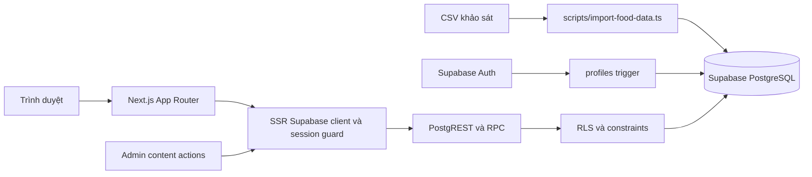

# Kiến trúc HANU Hungry

HANU Hungry là ứng dụng Next.js App Router dùng Supabase Auth và PostgreSQL. Dữ liệu quán bắt đầu từ CSV khảo sát, được chuẩn hóa thành quán, món và danh mục trước khi giao diện đọc. PostgreSQL RLS là ranh giới quyền cuối cùng; kiểm tra session ở Next.js giúp điều hướng và báo lỗi rõ ràng.

## Luồng tổng thể

Một request đọc thường đi từ Server Component trong `app/`, qua hàm dữ liệu trong `features/`, tới Supabase server client ở `lib/supabase/server.ts`. Server Actions kiểm tra đầu vào và tài khoản trước khi ghi. RPC tìm kiếm, trigger và RLS xử lý những quy tắc cần nhất quán dù Data API bị gọi trực tiếp.

Mốc kiểm chứng dữ liệu remote ngày 30/09/2026 sau seed: 59 quán, 950 món, 17 danh mục, 30 liên kết quán–danh mục; RPC search trả 59 quán khi không lọc. Tính đến 01/10/2026, remote đã áp dụng bốn migration và đã publish ba bài Blog hướng dẫn. Data quality report còn 9 địa chỉ thiếu, 29 quán chưa phân loại và 4 giá chỉ giữ được raw text. Generated TypeScript schema nằm tại `lib/supabase/database.types.ts`.

## Bố cục mã nguồn

| Vị trí | Trách nhiệm |
| --- | --- |
| `app/` | Route, metadata và bố cục trang. Trang đọc dữ liệu là Server Component mặc định. |
| `features/auth/` | Đăng ký, đăng nhập, đăng xuất, khôi phục/đổi mật khẩu và form tương tác. |
| `features/restaurants/` | Truy vấn quán/danh mục, kiểu dữ liệu trình bày và formatter cho giá/vị trí thiếu. |
| `features/gacha/` | Chọn ngẫu nhiên từ quán/món đã đọc trong database. |
| `features/history/` | Check-in chủ động, truy vấn lịch sử của chính user, streak và recap theo ngày Việt Nam. |
| `features/reviews/`, `features/notifications/`, `features/contact/`, `features/profile/` | Server Actions của từng nghiệp vụ. |
| `features/admin/` | Form, validation và Server Actions CRUD cho quán, món, danh mục, Blog; mỗi action kiểm tra `requireAdmin()`. |
| `components/` | Layout và thẻ giao diện dùng lại; nhận dữ liệu đã được truy vấn/format thay vì chứa logic quyền. |
| `lib/auth/` | Validation đầu vào, session helper `requireUser()`/`requireAdmin()`. |
| `lib/supabase/` | Client browser/server và client admin chỉ dành cho server. |
| `config/site.ts`, `app/globals.css`, `public/brand/` | Tên, navigation, liên hệ, màu và asset thương hiệu. |
| `supabase/migrations/` | Bảng, index, trigger, RLS, quyền SQL và RPC có thể tái tạo. |
| `scripts/` | Import CSV, bootstrap hai admin, seed ba bài Blog, kiểm tra database và smoke test RLS có cổng `--remote`. |
| `docs/` | Hợp đồng kiến trúc, dữ liệu, quyền và vận hành. |

Tránh đặt dữ liệu quán hardcode trong page. Một thay đổi về schema phải được phản ánh ở migration, type sinh từ database, data access trong feature, rồi mới đến component hiển thị. Component client chỉ dùng khi cần trạng thái hoặc sự kiện trình duyệt; Server Actions không tin payload từ client.

## Dữ liệu và nguồn thật

CSV có một STT quán lặp trên nhiều dòng món. Importer nhóm theo STT để upsert một `restaurants` row, phân tách danh mục nhiều nhãn qua `restaurant_categories`, rồi upsert món theo `dishes.source_key` ổn định. `source_row` chỉ để truy vết. Giá gốc ở `price_text`; `price_min_vnd`/`price_max_vnd` chỉ có khi parser chắc chắn. Không suy ra số 0 cho giá thiếu, không sinh tọa độ từ Plus Code hoặc địa chỉ.

`public.search_restaurants(query, category_slug, max_price_vnd, limit_count)` trả quán đang hoạt động, tìm tên quán/món/danh mục không phân biệt dấu tiếng Việt và lọc bằng giá số có thật. `listRestaurants()` trong `features/restaurants/data.ts` là điểm vào dùng chung cho trang chủ và tìm kiếm. Detail đọc quán, món và danh mục theo ID; URL Google Maps được tạo từ tọa độ thật hoặc chuỗi địa chỉ/Plus Code có sẵn. Formatter chung ở `features/restaurants/format.ts` xử lý dữ liệu trống trên các màn hình.

Mở trang quán không tạo check-in. `createCheckIn()` chỉ ghi khi user gửi hành động **Đã ăn**, sau khi xác minh quán và món. Trigger database yêu cầu món được chọn đang hoạt động và thuộc đúng quán; check-in cũ vẫn hợp lệ nếu món bị ẩn về sau. Streak, lịch sử và số liệu admin lấy từ `check_ins`. Review có `(user_id, restaurant_id)` duy nhất; user sửa/xóa bản ghi của mình, admin không có quyền moderation chỉ vì role ADMIN.

## Auth và quyền

`proxy.ts` làm mới cookie/session và đưa request tới login khi vào route bảo vệ. `requireUser()` lấy user Supabase và profile trên server; `requireAdmin()` kiểm tra role trước khi render khu vực `/admin`. Những guard này không thay RLS: policy ở database vẫn phải chặn cùng hành động khi gọi Data API trực tiếp.

Trigger trên `auth.users` tạo `profiles` với `student_code` 10 chữ số, `display_name` bằng email local-part và role `USER`. Không lấy role từ metadata do user gửi. Bootstrap hai admin là script vận hành riêng dùng service-role key tại runtime; app không có giao diện quản lý tài khoản user. Client thường và tác vụ admin nội dung nên dùng session của người đang đăng nhập để chính sách RLS và audit trigger có hiệu lực. Service-role client chỉ dùng cho bootstrap, import và đối chiếu an toàn ở khôi phục mật khẩu.

Ranh giới đọc/ghi chính:

| Đối tượng | Đọc | Ghi |
| --- | --- | --- |
| Khách chưa đăng nhập | Quán/món/danh mục/review của quán active; Blog published; site settings công khai | Không ghi dữ liệu ứng dụng |
| USER | Nội dung công khai, profile/check-in của mình, notification toàn cục và read-state của mình | Profile cột cho phép, check-in và review của mình, contact message |
| ADMIN | Nội dung kể cả inactive/draft, audit log và analytics tổng hợp | Quán/món/danh mục/Blog; không quản lý tài khoản hay review của user khác |

Xem chính sách chi tiết trong [DATABASE.md](DATABASE.md), [SECURITY.md](SECURITY.md) và [ADMIN_PERMISSIONS.md](ADMIN_PERMISSIONS.md).

## Blog, notification và analytics

Chỉ admin tạo/sửa/publish Blog. Trigger database đặt thời gian xuất bản và tạo một thông báo `ALL_USERS` khi bài lần đầu published; chỉnh sửa tiếp theo cập nhật cùng notification. Ba bài hướng dẫn SEO đã published trên remote. `notification_reads` lưu dấu đã đọc của từng user; Server Action dùng upsert bỏ qua bản ghi trùng để thao tác đánh dấu đã đọc lặp lại vẫn thành công mà không cần quyền UPDATE. Giao diện notification phải xử lý an toàn nếu Blog bị gỡ hoặc xóa. Ứng dụng không gửi email/push từ notification này.

`public.admin_analytics()` trả số liệu tổng hợp từ bảng nguồn, gồm check-in, review/rating, quán, danh mục, món và hoạt động theo ngày. Hàm kiểm tra admin trong database và không trả lịch sử cá nhân. Page view không được tính là một lần đã ăn.

## Giao diện và cấu hình

Giao diện dùng các phần dùng lại trong `components/`, palette/tokens ở CSS và nội dung điều hướng ở `config/site.ts`. Logo bánh mì gốc nằm tại `public/brand/logo.png`. Ảnh quán và mô tả chỉ dùng dữ liệu có thật hoặc placeholder trung tính. Mobile được thiết kế trước, với navigation và form đủ kích thước chạm; các bảng admin cần bố cục có thể dùng ở màn hình nhỏ.

Nếu đổi logo, màu, nền hoặc liên kết liên hệ, sửa asset/config/tokens tập trung thay vì sửa từng page. Các dịp Tết hoặc Giáng sinh có thể thêm biến thể theme ở lớp này mà không thay đổi truy vấn dữ liệu.

## Kiểm chứng và triển khai

- Unit tests kiểm tra MSSV/email local-part, bootstrap idempotence, CSV/giá/dedup, formatter và logic nghiệp vụ.
- `scripts/verify-database.ts` kiểm tra quyền anon, RPC và số lượng import; token USER/ADMIN tạm thời cho phép kiểm tra quyền đọc theo session.
- `scripts/security-smoke.ts --remote` tạo/xóa một USER thử để xác minh quyền ghi và ownership; không nằm trong `npm test` vì có thay đổi remote.
- Negative tests RLS phải kiểm tra thao tác ghi trực tiếp qua Data API, không chỉ thử ẩn nút trong UI.
- Chạy `npm run lint`, `npm run build`, kiểm tra TypeScript và QA các viewport 320–430, 768, 1024, 1440 px.
- Áp migration bằng dry-run và review trước khi push; import dữ liệu bằng script idempotent, sinh lại types từ schema thật, rồi mới cấu hình môi trường production.

Chi tiết lệnh chạy và biến môi trường nằm trong [README.md](../README.md). Không commit `.env.local`, password hay service-role key, không reset remote database để sửa lỗi migration.
