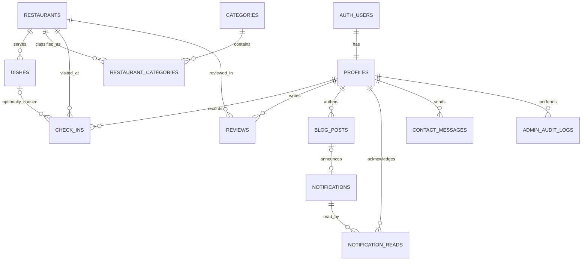

# HANU Hungry database

The application uses Supabase Auth for passwords and sessions and PostgreSQL for food data, check-ins, reviews, content, and notifications. All application tables are created by the checked-in migrations under `supabase/migrations/`. The food CSV is denormalized: one restaurant STT can appear on many dish rows. `restaurants.source_stt` identifies the restaurant in that source, while `dishes.source_key` identifies an imported dish without relying on its row position.

## Entity relationships

The tables are:

| Table | Purpose and key constraints |
| --- | --- |
| `profiles` | One row per `auth.users.id`; `student_code` is unique and exactly ten ASCII digits. `role` is the `USER`/`ADMIN` enum, defaults to `USER`. No password field exists. |
| `restaurants` | One row per surveyed restaurant; nullable, unique `source_stt` allows idempotent CSV upsert. Address and Plus Code are text; coordinates remain null unless supplied as real coordinates. `is_active` supports deactivation without destroying history. |
| `categories`, `restaurant_categories` | Normalized many-to-many categories. A restaurant may have several categories. Category slugs are unique. |
| `dishes` | Restaurant menu items. Nullable, unique `source_key` supports stable source upsert; `source_row` is trace information only. Raw `price_text` is preserved. Numeric minimum and maximum VND prices are nullable and constrained to nonnegative, ordered values. |
| `check_ins` | Explicit “Đã ăn” actions, linked to a user and restaurant; dish is optional. A trigger rejects a selected dish unless it belongs to that restaurant and is active. Existing check-ins remain valid if a dish is later deactivated. Opening a detail page does not create this row. |
| `reviews` | User-owned restaurant comments, with optional integer rating constrained to 1–5. A review must have a rating or nonblank comment. `(user_id, restaurant_id)` is unique. |
| `blog_posts` | Admin-authored draft or published posts, with slug, cover, SEO fields, and publish timestamp. |
| `notifications`, `notification_reads` | One global notification per blog publish, with per-user read state. The unique `(blog_post_id, type)` constraint and publish trigger prevent repeat notices on normal edits. |
| `contact_messages` | Authenticated contact form submissions. The public API allows submission, not browsing other messages. |
| `site_settings` | Public presentation settings only. It must never contain credentials or private configuration. |
| `admin_audit_logs` | Append-only records for authenticated admin mutations to restaurants, dishes, categories, category links, and blogs. Clients cannot write logs directly. |

Restaurant deletion is restricted once check-ins or reviews refer to it. In that case, admins should set `is_active = false`. Dish deletion sets the optional `check_ins.dish_id` to null while preserving the restaurant visit. Deleting a blog leaves its notification with a null `blog_post_id`; the application must show a safe unavailable-content state.

## Auth and admin bootstrap

`auth.users` is the only password store. An `AFTER INSERT` trigger creates each profile from the signup email and `raw_user_meta_data.student_code`, validating the ten-digit student code. Its `display_name` is the email local-part and its role is **always** `USER`; user metadata is never accepted as an authority for roles. The signup server validates the same fields before calling Supabase Auth.

The separately maintained bootstrap script creates or finds the two authorized admin Auth users, then upserts their profiles through a **server-only service-role client**. Only this trusted bootstrap promotes those profiles to `ADMIN`. A user session has column-level permission to update only its own `display_name` and `avatar_url`. A trigger also rejects authenticated changes to profile identity or role. Admins have no Data API privilege or application route to edit other profiles or manage Supabase Auth users.

The two initially authorized admin identities are `linhphamhn342@gmail.com` (`2404060021`) and `mtvzzn@gmail.com` (`2404060034`). Passwords and service-role credentials must come from runtime environment variables and must not enter migrations, seed data, logs, client bundles, or Git.

## Access model

All thirteen `public` tables have RLS enabled. Table grants are explicitly reduced before policies are added. `service_role` bypasses RLS for trusted server tasks; routine admin content actions should use the signed-in user's session so RLS and audit logging apply.

| Data | Anonymous | Signed-in user | Signed-in admin |
| --- | --- | --- | --- |
| Profile | None | Read self; update own display name/avatar | Same self access; no user management |
| Restaurant, category, dish | Read active records | Read active records | Read all; create, update, deactivate/delete |
| Check-in | None | CRUD own only | CRUD own only; aggregate analytics RPC for all users |
| Review | Read reviews for active restaurants | Read reviews for active restaurants; CRUD own | Same ownership rule; no moderation privilege |
| Blog | Read published | Read published | CRUD drafts and published posts |
| Notification | None | Read global notices; manage own read state | Same user behavior |
| Contact message | None | Submit own | Submit own; no raw-message browsing grant |
| Site setting | Read public values | Read public values | Read public values; no user-facing write route |
| Audit log | None | None | Read logs; writes happen only through triggers |

`public.is_admin()` is a fixed, `SECURITY DEFINER` helper that checks `profiles.role` for `auth.uid()`. It neither changes roles nor grants identity-management capability. User-authored reviews remain owned by the user even if that user also has the admin role.

## Search and analytics RPCs

`public.search_restaurants(query text DEFAULT NULL, category_slug text DEFAULT NULL, max_price_vnd integer DEFAULT NULL, limit_count integer DEFAULT 24)` is callable before or after login. It returns `id`, `name`, `area`, `address_text`, `image_url`, `min_price_vnd`, and `categories` (text array). It searches active restaurant names, active dish names, and category names with accent-insensitive Vietnamese matching via `unaccent`. Category filter uses a slug. Price filter includes only active dishes with a known numeric `price_min_vnd` at or below the maximum, so missing prices never become zero. The row limit is clamped to 1–100.

`public.admin_analytics()` returns JSON aggregates to admins only: active restaurant and dish counts, total check-ins, review count and average rating, popular restaurants/categories/dishes, and activity by day in Vietnam time. It reads source tables directly and returns no individual user history. Non-admin calls raise a permission error. Check-ins, not page views, are the activity source.

## Publishing and audit behavior

A blog insert or transition to `published` sets `published_at` if absent. The publish trigger creates one `ALL_USERS` in-app notification with a link to the blog. Subsequent title, excerpt, or slug edits update that notification's display fields instead of making another row. Three editorial posts are published on the linked remote. Notification reads are stored once per `(notification_id, user_id)`; the read action uses an insert/upsert that ignores duplicates, so repeating it needs no update permission. There is no email or external push notification in this schema.

Admin changes to restaurants, dishes, categories, category links, and blogs produce an audit row with admin ID, action, entity type/key, timestamp, and a short label. The audit trigger skips service-role imports and owner maintenance. It does not copy blog content, passwords, tokens, or secrets into audit metadata.

## Applying and verifying migrations

1. Review the four migrations and the linked database state. `20260930000100` creates the schema, `20260930000200` grants/RLS/RPCs, `20260930000300` makes the Blog trigger safe on draft inserts, and `20261001000100` requires an active dish for new or changed check-ins. Do not reset a remote database.
2. Run `npx supabase db push --dry-run` and inspect the SQL plan.
3. Apply `npx supabase db push` only after confirming the plan is safe for the linked project.
4. Run the idempotent importer and check the data quality report in `docs/DATA_IMPORT.md`.
5. Generate `lib/supabase/database.types.ts` from the applied Supabase schema and use those types in application data access.
6. Verify that a user cannot update `profiles.role` or `student_code`, access another user's check-ins, mutate restaurant content, publish blogs, or change another user's review. Verify that a content admin cannot manage Auth users through the app.

The migration files do not include admin passwords or service-role credentials. The `unaccent` extension is installed under the `extensions` schema for the search RPC. If the linked project already has `unaccent` installed in another schema, inspect that state before applying this migration.
